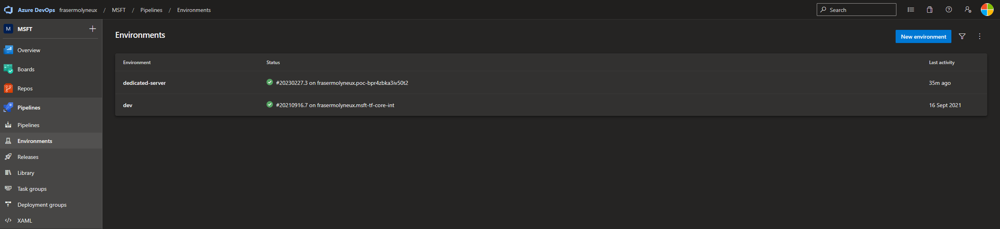
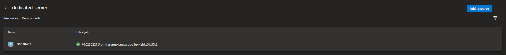
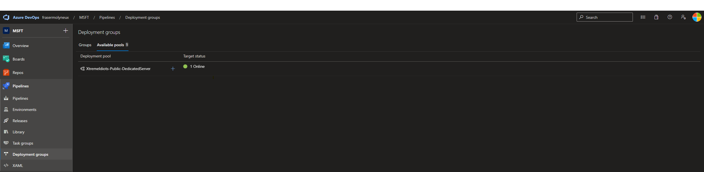

# POC - IIS Deployment to Virtual Machines

This is a simple proof of concept to document the deployment of some IIS configuration to a virtual machine; this is likely to be in the context of a on-premises customer environment. Documentation context is for a customer that is considering moving from classic to YAML pipelines in which classic pipelines are using 'Deployment Groups' to deploy to virtual machines.

---

## Azure DevOps Configuration

The virtual machine resources are added to 'environments' under 'Pipelines' in Azure DevOps; see example where an environment 'dedicated-server' has been created and and a virtual machine 'NS570403' has been added to it.





In the background this will actually create a 'deployment group' in Azure DevOps that will be sat in the 'Available pools' section of the 'Deployment Groups' page. This however isn't used by the YAML.



---

## Referencing in YAML

To deploy to the virtual machine through YAML the `deployment` job is used; this will reference the `environment` and have the `resourceType` set to `VirtualMachine`. When this executes it will be in the context of that environment and any virtual machines that have been added to it.

For full documentation of the deployment job see [here](https://docs.microsoft.com/en-us/azure/devops/pipelines/process/deployment-jobs?view=azure-devops).

A minimum example is shown below:

```yaml
trigger: none
pr: none

stages:
- stage: 'Deploy'
  jobs:
  - deployment: 'DeployToDedicatedServer'
    environment:
      name: dedicated-server
      resourceType: VirtualMachine

    strategy:
      runOnce:
        deploy:
          steps:
            - task: PowerShell@2
              inputs:
                targetType: 'inline'
                script: |
                  Write-Host "Running on $($env:COMPUTERNAME)"
```
